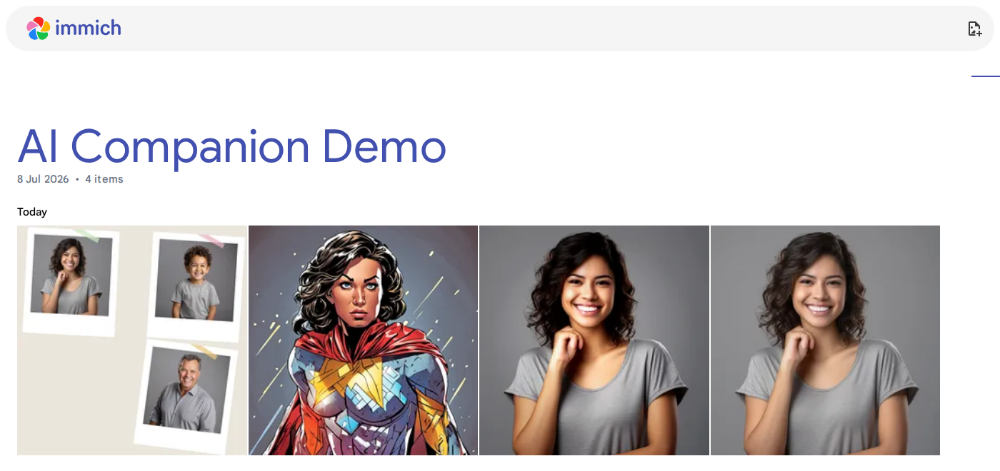
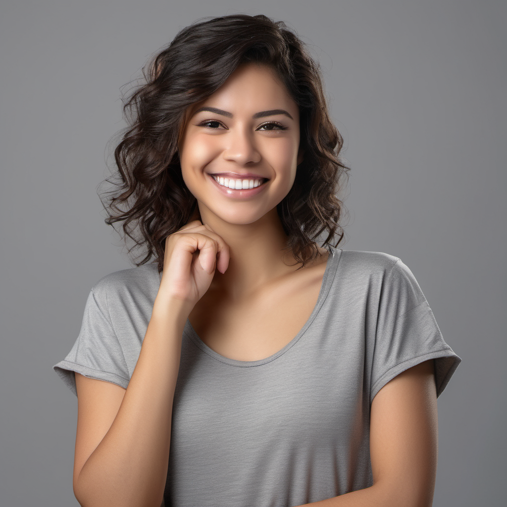
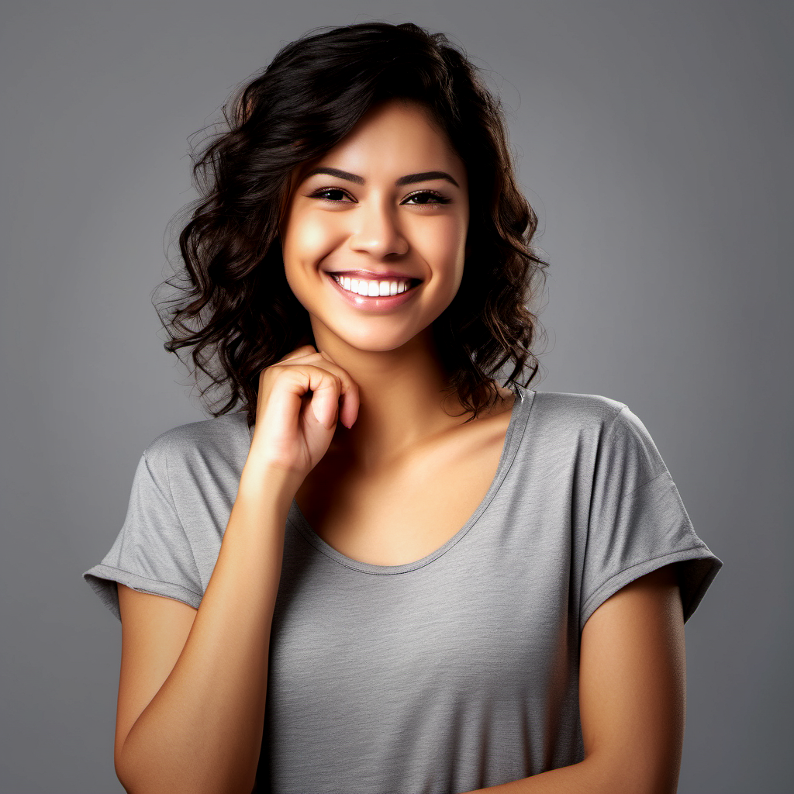
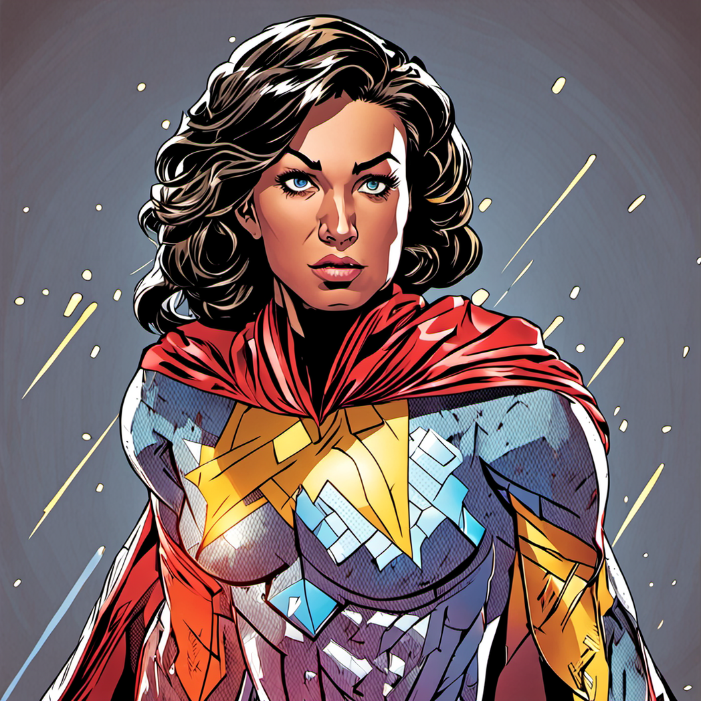
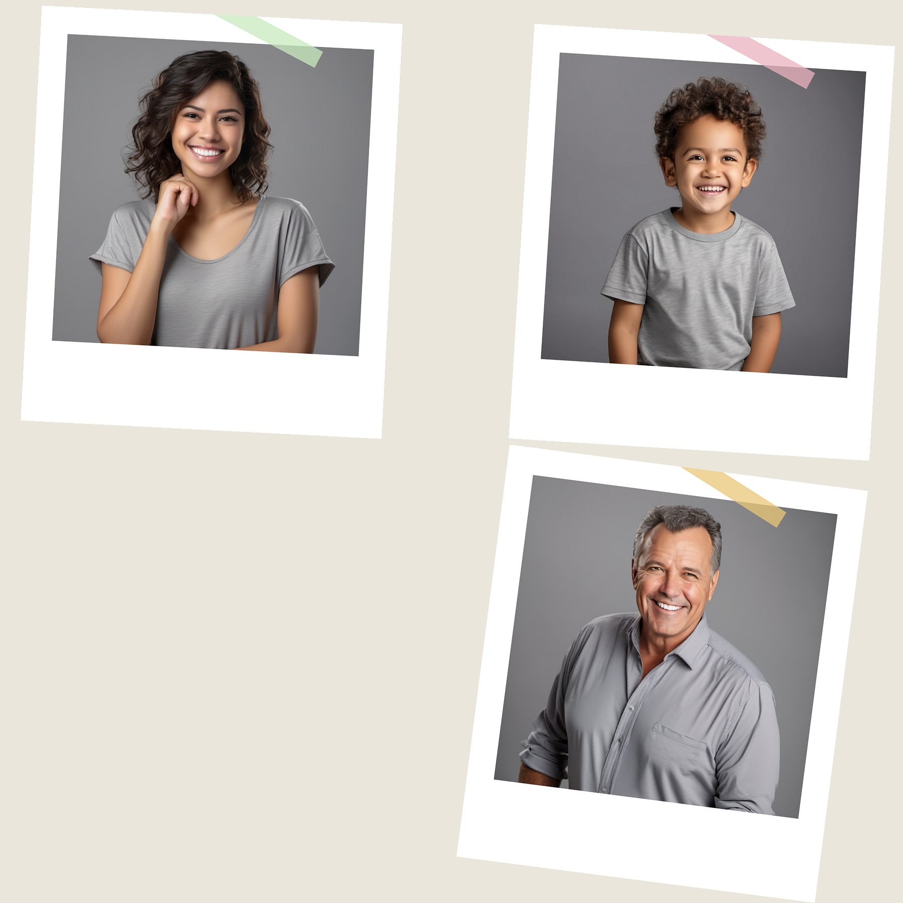

# Immich AI Companion

A self-hosted set of background workers that connect [Immich](https://immich.app) to
[Ollama](https://ollama.com) (vision-language models) and [ComfyUI](https://www.comfy.org)
(SDXL / upscaling / face-restore) to automatically generate AI restorations,
creative restyles, filter presets, cartoon transformations, and themed
collages from photos already in your Immich library — then upload the
results straight back into Immich as new albums.

Everything runs on your own hardware. No image ever leaves your network.

> **Sample images in this repo are 100% synthetic.** They're SDXL
> text-to-image generations of fictional people, run through this project's
> own effects to demonstrate them — not photos of any real person, and not
> related to any of this project's actual (private) usage.

## Why this exists

Immich is genuinely great at *organizing and finding* your photos (facial
recognition, CLIP-based semantic search, and — as of Immich 3.0 — basic
non-destructive crop/rotate editing). What it doesn't do is *generate* new
images from your photos. There's no SDXL/ComfyUI integration, no LLM
integration, and no filter/style/collage generation anywhere in Immich core —
filters are explicitly listed as "planned but not yet implemented" even in
the 3.0 editor. This project fills that gap as a set of independent
background workers that talk to Immich purely over its public API.

| | Immich core (3.0) | This project |
|---|---|---|
| Face recognition & search | ✅ (InsightFace, CLIP) | uses Immich's own face data |
| Crop / rotate | ✅ (non-destructive editor) | — |
| Color-grade filters | 🚧 planned, not shipped | ✅ 11 presets, auto-picked |
| AI photo restoration | ❌ | ✅ upscale + face-restore |
| AI creative restyle | ❌ | ✅ SDXL img2img, identity-preserving |
| Cartoon/character transformation | ❌ | ✅ 11 styles, auto-picked with forced rotation |
| Auto-generated collages | ❌ | ✅ 10 templates, 3–10 photos, face-aware cropping |
| "Then & now" nostalgia collages | ❌ | ✅ quality-scored photo pairing |

## What it does

Five independent workers, each runnable standalone (e.g. from cron):

- **`app.pipeline`** — Restore: ESRGAN upscale + CodeFormer face-restore.
  Deterministic and identity-preserving (no generative hallucination).
- **`app.design_pipeline`** — Design: SDXL img2img creative restyle, picked
  from a prompt library by a vision model looking at the photo, with
  identity-preserving face-swap (ReActor) so the *scene* changes but the
  *person* doesn't.
- **`app.filter_pipeline`** — Filter: Google-Photos-style color-grade presets
  (`vivid`, `bw_noir`, `warm_golden`, `cool_blue`, `vintage_faded`,
  `soft_glow`, `clarendon`, `teal_orange`, `matte_faded`, `cozy_golden`,
  `pastel_dream`), auto-picked per photo by a vision model. Also drives the
  **Collage** step below.
- **Collage** (part of the filter worker) — composites a random selection of
  10 templates (`grid_2x2`, `hero_duo`, `filmstrip_3`, `polaroid_scatter`,
  `photo_booth_strip`, `circle_frame`, `washi_scrapbook`, `mosaic_5`,
  `retro_filmstrip`, `two_photo_captioned`) from a **randomized 3–10 photo
  count** each run, with face-aware cropping (zooms on the recognized
  subject's face rather than a blind center-crop) and blur/sharpness
  filtering so low-quality shots don't get picked. Occasionally builds a
  **"then and now"** comparison instead — a person's oldest vs. newest
  available photo, captioned with the year and an auto-picked mood emoji.
- **`app.cartoon_pipeline`** — Cartoon: turns the subject into an animated
  character in one of 11 styles (`anime`, `cartoon_3d` (Pixar-style),
  `disney_2d` (classic hand-drawn), `indian_superhero`, `minecraft`,
  `superhero`, `lego`, `claymation`, `figurine_3d`, `funko_pop`,
  `retro_film`), auto-picked by a vision model with **forced rotation**
  through the whole style list so it doesn't just keep picking the same one.
  Also builds a side-by-side "Cartoon vs. Original" comparison collage.

Every worker scopes itself to a configurable list of Immich-tagged people
(`AIENH_TARGET_PEOPLE`), uploads its output into its own Immich album, and
records what it did in a local SQLite database (`data/prompts.db`, created
by `data/init_db.py` — never committed, it's your own personal history).

See **[TEMPLATES.md](TEMPLATES.md)** for the full list of every collage
layout, cartoon style, and filter preset actually available, with a
one-line description of each.

## Samples

All generated from the same fully-synthetic starting photo (`samples/sample_original.png`) —
no real person's likeness anywhere in this repo.

**Uploaded results, as seen in Immich itself** (a dedicated demo album
containing only these synthetic samples — real screenshot, no real photos):



| Original (synthetic) | `vivid` filter | `superhero` cartoon |
|---|---|---|
|  |  |  |

**`washi_scrapbook` collage** (3 more synthetic photos, scattered/rotated with a torn-tape accent):



## Architecture

```
Immich  <---HTTP--->  this project (cron-scheduled Python workers)
                              |
                              |--HTTP--> Ollama    (vision-language model: style/filter/prompt selection)
                              |--HTTP--> ComfyUI    (SDXL base+refiner, ESRGAN upscale, CodeFormer, ReActor)
                              |
                        local SQLite (run history, prompt library)
```

- `app/immich_client.py` — thin Immich REST API client (search, download,
  upload, face data).
- `app/ollama_client.py` — vision-model calls for every "pick the best X for
  this photo" decision (style, filter, prompt, mood emoji, gender).
- `app/comfyui_client.py` — builds and submits the ComfyUI workflow graphs
  (upscale/restore, SDXL img2img, color-grade filter).
- `app/collage.py` — pure-PIL compositing (no GPU) for every collage
  template, plus face-aware cropping and a Laplacian-variance blur/sharpness
  scorer.
- `app/db.py` — SQLite persistence for run history and the prompt library.
- `app/config.py` — every tunable setting, documented inline, all
  overridable via environment variables.

## Setup

**Requirements:** a running [Immich](https://immich.app) server, an
[Ollama](https://ollama.com) install with a vision-capable model pulled
(e.g. `ollama pull qwen3-vl:8b`), and a [ComfyUI](https://www.comfy.org)
install with an SDXL base+refiner checkpoint plus the
[ComfyUI-Impact-Pack](https://github.com/ltdrdata/ComfyUI-Impact-Pack) /
[ReActor](https://github.com/Gourieff/comfyui-reactor-node) /
[Ultimate SD Upscale](https://github.com/ssitu/ComfyUI_UltimateSDUpscale)-style
nodes for face-restore/face-swap/upscale (see `app/comfyui_client.py` for the
exact node types each workflow expects).

```bash
git clone <this-repo-url>
cd immich-ai-companion
python3 -m venv .venv && source .venv/bin/activate
pip install -r requirements.txt

cp .env.example .env
# edit .env: set AIENH_IMMICH_URL, AIENH_IMMICH_API_KEY, AIENH_TARGET_PEOPLE,
# AIENH_MAC_HOST (or AIENH_OLLAMA_URL / AIENH_COMFYUI_URL separately)

python data/init_db.py          # creates data/prompts.db, seeds the design worker's prompt library
python data/generate_filter_assets.py  # regenerates data/filter_assets/*.png if needed (already included)

# Try one worker manually first:
python -m app.filter_pipeline
```

Once that works, schedule each worker with cron (or any scheduler) — each is
a plain `python -m app.<worker>` invocation:

```cron
0 3 * * * cd /path/to/immich-ai-companion && .venv/bin/python -m app.pipeline         >> logs/restore.log 2>&1
0 4 * * * cd /path/to/immich-ai-companion && .venv/bin/python -m app.design_pipeline  >> logs/design.log  2>&1
0 5 * * * cd /path/to/immich-ai-companion && .venv/bin/python -m app.filter_pipeline  >> logs/filter.log  2>&1
0 6 * * * cd /path/to/immich-ai-companion && .venv/bin/python -m app.cartoon_pipeline >> logs/cartoon.log 2>&1
```

## Configuration

`.env.example` covers the required settings and the most commonly tuned
ones. Every worker has far more knobs than that (denoise strengths, SDXL
step counts, collage sizing/probability/quality thresholds, per-worker daily
image counts, etc.) — all of them live in `app/config.py` as
`os.environ.get("AIENH_...", <default>)` with a comment explaining what each
one does and why its default is what it is. Nothing needs code changes to
retune; every value is an environment variable.

## Privacy note for anyone forking this

If you fork/use this for your own Immich library: `data/prompts.db` (created
by `data/init_db.py`) will accumulate your own real photo filenames, Immich
asset IDs, and AI-composed descriptions of your own photos as the workers
run. It's already gitignored here — keep it that way if you ever publish
your own fork publicly.

## License

MIT — see [LICENSE](LICENSE).
