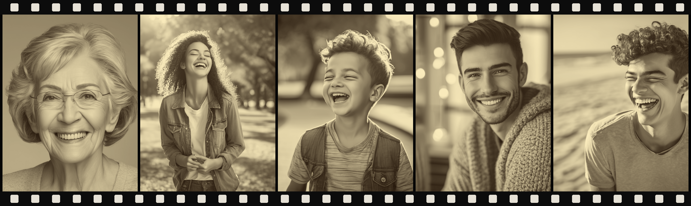
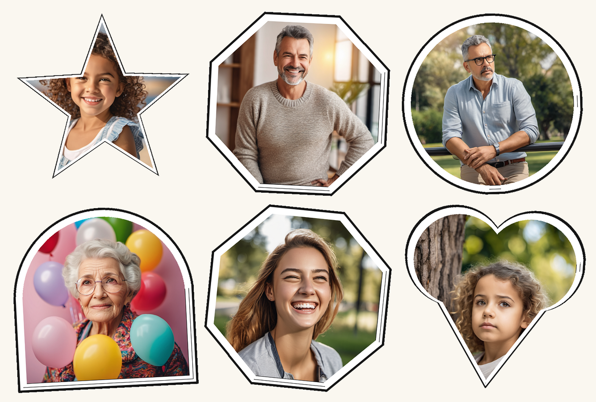
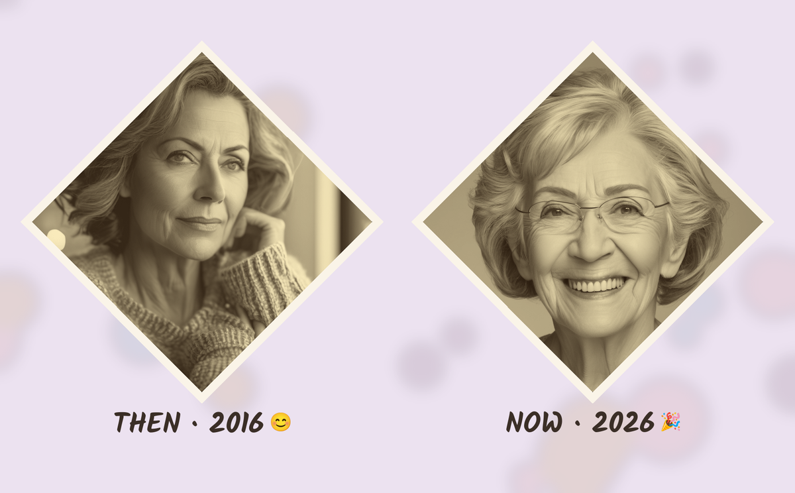
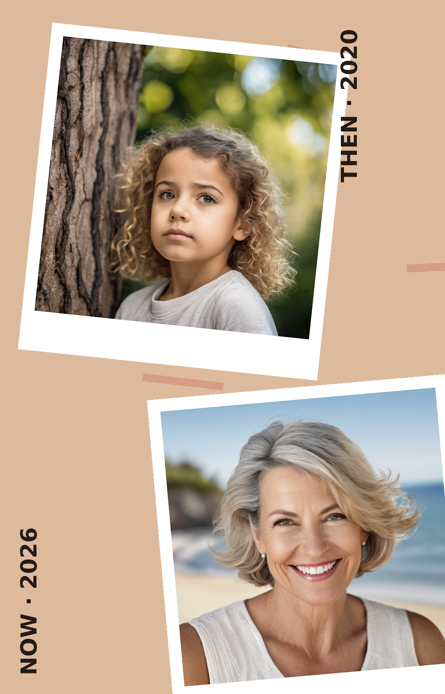
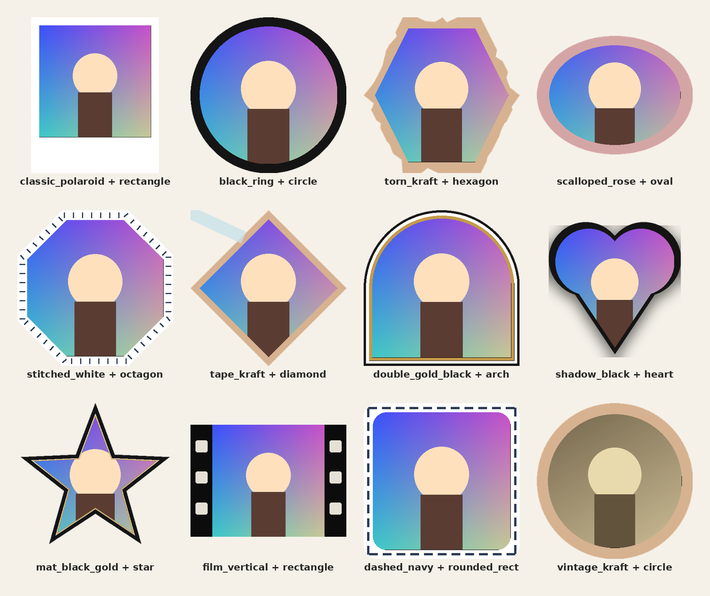
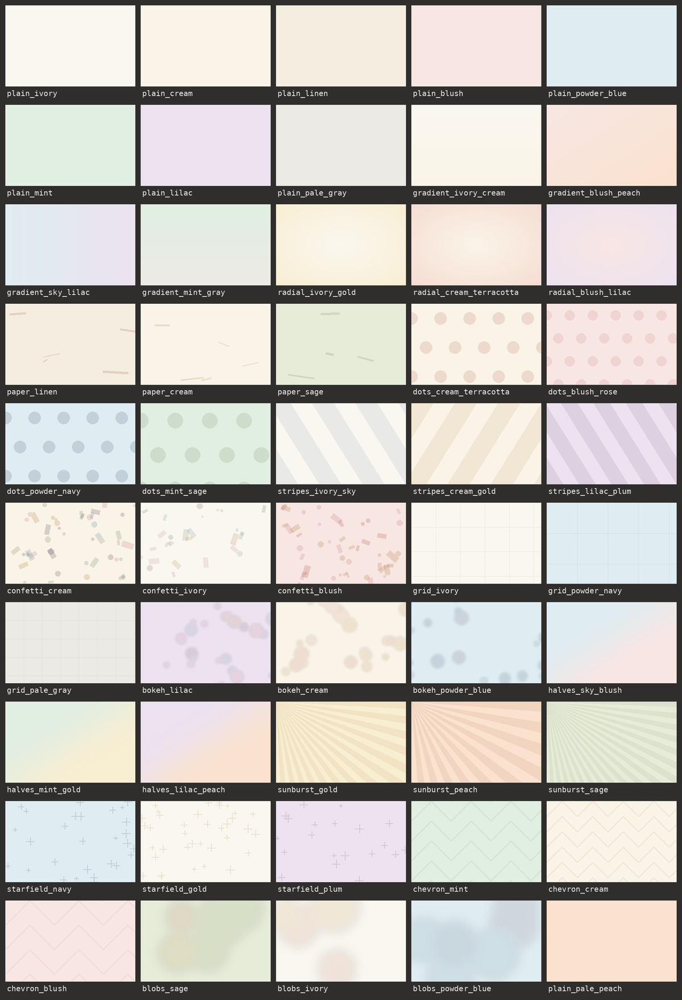

# Templates reference

Every style/layout choice below is picked automatically per photo (usually by
a vision-language model looking at the photo, sometimes randomly) - nothing
here needs to be selected manually. This doc is just a reference for what's
actually available. Source of truth is always the code linked next to each
section; this file can drift, that can't.

All sample images in this doc are rendered from synthetic AI-generated
placeholder photos or procedural graphics - no real people or personal
photos.

## The five image types

| Worker | Source | What it generates |
|---|---|---|
| **AI Restore** | [`app/pipeline.py`](app/pipeline.py) | Identity-preserving enhancement: ComfyUI upscale + face restoration of the original photo. |
| **AI Design** | [`app/design_pipeline.py`](app/design_pipeline.py) | SDXL restyle of the photo using a prompt picked from a ~1,000-prompt library, with identity-preserving face swap. |
| **AI Filter** | [`app/filter_pipeline.py`](app/filter_pipeline.py) | Google Photos-style color-grade presets, plus multi-photo collages and "then and now" pairs. |
| **AI Cartoon** | [`app/cartoon_pipeline.py`](app/cartoon_pipeline.py) | Cartoon/character transformation, plus a cartoon-vs-original comparison collage. |
| **Collage / Then & Now** | [`app/collage.py`](app/collage.py) | Pure-PIL layout system used by the filter and cartoon workers - templates, frames, backgrounds, caption fonts (everything below). |

## AI Restore

No style options - it always runs the same identity-preserving chain: an
upscale model plus a face-restoration model in ComfyUI (models are
configurable via `AIENH_COMFYUI_UPSCALE_MODEL` /
`AIENH_COMFYUI_FACERESTORE_MODEL`). Output is the same photo, sharper.

## AI Design (restyle prompts)

Defined in [`app/design_pipeline.py`](app/design_pipeline.py) with prompt
selection in [`app/ollama_client.py`](app/ollama_client.py). The library
(seeded by [`data/prompts_seed.json`](data/prompts_seed.json) /
`data/init_db.py`) holds roughly 1,000 prompts across 100+ categories -
Cinematic, Business & Professional, Black & White, Fashion & Editorial,
Aesthetic, 3D Animation, Character Design, Celebration, Action, Lifestyle,
Couple, and many more.

Per photo, a vision model first chooses the best-fitting *category* for the
photo, then the best *prompt* within it (preferring prompts tagged with the
detected subject gender when the category has them). Used prompts are marked
in the DB so the library rotates instead of repeating favorites. The chosen
prompt drives an SDXL img2img restyle, followed by an identity-preserving
face swap so the person still looks like themselves.

## Cartoon/character styles

Defined in [`app/cartoon_styles.py`](app/cartoon_styles.py). One is picked
per photo by a vision model (`ollama_client.select_best_character_style`),
which **excludes the N most recently used styles** first
(`db.get_recent_variants`) so it cycles through the whole list instead of
developing a favorite.

| Style | Description |
|---|---|
| `portrait_3d` | Stylized Pixar-style 3D render that keeps the person's real, natural face (identity-preserving swap) - the closest-to-the-original style. |
| `anime` | Japanese anime/manga style - expressive portraits, dynamic poses. |
| `cartoon_3d` | 3D Pixar/Disney-style animated cartoon - warm, family-friendly, whimsical. |
| `disney_2d` | Classic hand-drawn 2D Disney animated-film style - storybook, fairy-tale look. |
| `indian_superhero` | Desi comic-book superhero style - bold, culturally-rooted heroic look. |
| `superhero` | Western comic-book superhero transformation - action-movie-poster look. |
| `minecraft` | Minecraft video-game blocky voxel style - fun, playful, gamer-kid look. |
| `lego` | LEGO minifigure style - playful, blocky toy-like look. |
| `funko_pop` | Funko Pop vinyl bobblehead figure style - cute, big-head collectible toy look. |
| `figurine_3d` | Photorealistic 3D collectible action-figure material - the "3D printed figure" trend. Keeps the real face (identity-preserving swap). |
| `claymation` | Stop-motion claymation style - warm, handcrafted, nostalgic look. |
| `retro_film` | Vintage 1950s Hollywood film-noir look with a physical filmstrip border. |

Styles that render a realistic or 3D face (`portrait_3d`, `figurine_3d`) swap
the person's real face back in via ReActor with FaceBoost (the swapped face is
restored and upscaled *before* pasting, since the swap model works at 128px);
flat 2D styles keep the fully stylized face on purpose. The prompt composer
always describes the subject(s) first - count, age, gender, outfit - so the
person stays the focus of the generated scene.

After the transformation, the worker also builds a cartoon-vs-original
comparison using the `two_photo_captioned` collage system below (captions
`"Cartoon"` / `"Original"`).

## Filter presets

Defined in [`app/filters.py`](app/filters.py). One is picked per photo by a
vision model (`ollama_client.select_best_filter`), Google Photos-style - no
forced rotation here since color grading is much more photo-dependent than
"which cartoon style," unlike the cartoon worker above.

| Preset | Description |
|---|---|
| `vivid` | Bright, punchy, highly saturated colors - landscapes, food, bold scenes. |
| `clarendon` | Bright punchy contrast with a cool-tinted highlight - Instagram's iconic look. |
| `teal_orange` | Cinematic movie-poster grade - teal shadows, warm orange skin/highlights. |
| `warm_golden` | Warm golden-hour tone - sunsets, outdoor portraits, cozy scenes. |
| `cozy_golden` | Warm golden-hour tone plus a soft glow - warm indoor/portrait shots. |
| `cool_blue` | Cool cinematic blue/teal tone - city, night, or overcast shots. |
| `bw_noir` | Classic dramatic black & white - portraits, moody or high-contrast shots. |
| `vintage_faded` | Faded retro film look with light grain - nostalgic or candid photos. |
| `matte_faded` | Flat matte look with lifted blacks and muted tone - everyday VSCO-style look. |
| `soft_glow` | Soft dreamy glow - flattering for portraits, kids, close-ups. |
| `pastel_dream` | Soft, light, low-contrast pastel look - dreamy and airy, bright/minimal scenes. |

## Collage layouts

Defined in [`app/collage.py`](app/collage.py), dispatched by `build_collage()`
based on how many photos are available (a random count between
`AIENH_COLLAGE_PHOTO_COUNT_MIN` and `AIENH_COLLAGE_PHOTO_COUNT_MAX`, default
3-10). Some layouts need an exact count; most scale to any count.

| Template | Photo count | Description |
|---|---|---|
| `grid_2x2` | 4 | Plain even 2×2 grid, equal-size squares. |
| `hero_duo` | 3 | One large "hero" photo, two smaller photos stacked beside it. |
| `filmstrip_3` | 3 | Horizontal strip of 3 frames on a dark background. |
| `mosaic_5` | 5 | One large hero photo + a 2×2 grid of 4 small tiles beside it. |
| `polaroid_scatter` | any | Photos scattered at random positions/angles across a grid of cells, like polaroids tossed on a table. |
| `washi_scrapbook` | any | Same scatter mechanic as `polaroid_scatter`, plus a colored washi-tape accent drawn across one corner of each photo. |
| `photo_booth_strip` | any | Classic vertical photo-booth print - photos stacked in one tall strip. |
| `circle_frame` | any | Photos cropped into circles, laid out in a clean row. |
| `retro_filmstrip` | any | Sepia-toned horizontal filmstrip bordered top and bottom by sprocket-hole bars, like a physical cut of 35mm film. |
| `framed_mosaic` | any | Every photo in a decorative frame - one shared skin, its own random shape - gently rotated on a random background scene (see the frame/background libraries below). |
| `two_photo_captioned` | 2 | Used for the "then and now" style and the cartoon-vs-original comparison - see below, it's its own mini-system. |





All templates use face-aware cropping (`_crop_to_face` in `app/collage.py`) -
photos zoom in on the recognized subject's face rather than a blind center
crop, so heads don't get cut off and faces aren't tiny.

### `two_photo_captioned` - three sub-layouts

Every call randomly picks one of three layouts (`app/collage.py`,
`_two_photo_side_by_side` / `_two_photo_stacked` / `_two_photo_diagonal`),
then a random background scene, a random frame skin+shape shared by both
photos, and a random handwritten caption font. Captions are drawn in dark
ink just *outside* each frame's edge - near the frame but never overlapping
it or the face inside it.

| Layout | Description |
|---|---|
| Side by side | Two framed photos left/right on a background scene, ink caption just below each frame. |
| Stacked | Two framed photos top/bottom; captions on the outward edges (above the top frame, below the bottom one). |
| Diagonal | Scrapbook-diary style: framed photos cascade diagonally at their own gentle rotation, with a bold vertical date/label in the margin beside each one. |





Used by:
- **Collage worker's "then and now" style** - captions `"THEN · <year>"` /
  `"NOW · <year>"`, optionally with a vision-model-picked mood emoji
  (`filter_pipeline._build_then_and_now_photo`). Capture years for forwarded
  WhatsApp media are recovered from the `IMG-YYYYMMDD-WA....` filename when
  the EXIF date is missing.
- **Cartoon worker's comparison collage** - captions `"Cartoon"` /
  `"Original"` (`cartoon_pipeline._build_comparison_collage`).

## Frame styles: skins × shapes

[`app/frame_styles.py`](app/frame_styles.py) is a composable library for
wrapping a single photo in a decorative frame, along two independent axes -
any of the 50 **skins** (the decoration) can wrap any of the 10 **shapes**
(the silhouette). Combined with the 50 backgrounds below, that's 25,000
distinct looks before a single layout choice is even made.

```python
from app import frame_styles

framed = frame_styles.apply_frame(photo, "torn_kraft", "hexagon")

# or let it pick for you
skin_name, shape_name = frame_styles.random_frame()
```

A sample of 12 skin+shape combinations (rendered on a placeholder graphic):



### Shapes (10)

| Shape | Notes |
|---|---|
| `rectangle` | Plain rectangle - the default every skin was built around. |
| `rounded_rect` | Rectangle with rounded corners. |
| `circle` | Full circle. |
| `oval` | Circle squashed vertically. |
| `hexagon` | Six-sided polygon. |
| `octagon` | Eight-sided polygon. |
| `diamond` | Rotated square. |
| `arch` | Rounded-top rectangle, like a window/doorway. |
| `heart` | Two lobes + a point. |
| `star` | Five-pointed star. |

Skins that trace individual straight edges (dashed / scalloped / torn /
stitched lines) only make sense on a polygon-ish silhouette - on a curved
shape (`circle`, `oval`, `arch`, `heart`, `star`) they gracefully fall back
to a plain solid ring of the same color.

### Skins (50)

| Skin | Description |
|---|---|
| `classic_polaroid` | White polaroid print, thick bottom border. |
| `cream_polaroid` | Warm cream-toned polaroid print. |
| `black_polaroid` | Black-bordered polaroid print, modern gallery look. |
| `kraft_polaroid` | Kraft-paper-toned polaroid print. |
| `sepia_polaroid` | Vintage sepia-toned photo in a cream polaroid frame. |
| `thin_white_ring` | Slim clean white ring. |
| `thick_white_ring` | Bold wide white ring, gallery-print look. |
| `black_ring` | Bold solid black ring. |
| `charcoal_ring` | Softer charcoal-gray solid ring. |
| `kraft_ring` | Warm kraft-paper solid ring. |
| `rose_ring` | Dusty rose solid ring. |
| `sage_ring` | Muted sage-green solid ring. |
| `navy_ring` | Deep navy solid ring. |
| `gold_ring` | Warm gold solid ring. |
| `sky_ring` | Soft sky-blue solid ring. |
| `plum_ring` | Deep plum solid ring. |
| `thin_black_line` | Very slim black line ring, minimal modern look. |
| `thin_gold_line` | Very slim gold line ring, elegant minimal look. |
| `double_classic` | White inner line + black outer line, gallery-mat look. |
| `double_gold_black` | Gold inner line + black outer line, formal portrait look. |
| `double_navy_cream` | Navy inner line + cream outer line. |
| `dashed_charcoal` | White ring with a dashed charcoal line traced along the edges. |
| `dashed_terracotta` | Cream ring with a dashed terracotta line traced along the edges. |
| `dashed_navy` | White ring with a dashed navy line traced along the edges. |
| `scalloped_cream` | Cream ring with a scalloped (semicircle-cut) outer edge. |
| `scalloped_white` | White ring with a scalloped outer edge, dainty vintage look. |
| `scalloped_rose` | Dusty rose ring with a scalloped outer edge. |
| `torn_cream` | Cream ring with a jagged, hand-torn-paper edge. |
| `torn_kraft` | Kraft-paper ring with a jagged torn edge, rustic scrapbook look. |
| `torn_white` | White ring with a subtle torn-paper edge. |
| `ornament_gold` | White ring with gold triangle ornaments in each corner. |
| `ornament_navy` | Cream ring with navy corner ornaments. |
| `ornament_terracotta` | White ring with terracotta corner ornaments. |
| `tape_white` | White ring with a single washi-tape accent across one corner. |
| `tape_kraft` | Kraft-paper ring with a washi-tape accent. |
| `tape_cream` | Cream ring with a washi-tape accent. |
| `shadow_white` | Clean white ring with a soft drop shadow. |
| `shadow_cream` | Cream ring with a soft drop shadow. |
| `shadow_black` | Black ring with a soft drop shadow, dramatic gallery look. |
| `film_vertical` | 35mm filmstrip sprocket holes down both sides (rectangle only). |
| `film_horizontal` | 35mm filmstrip sprocket bars across top and bottom (rectangle only). |
| `stitched_cream` | Cream ring with terracotta hand-stitched tick marks along the edges. |
| `stitched_white` | White ring with navy hand-stitched tick marks along the edges. |
| `stitched_kraft` | Kraft-paper ring with cream hand-stitched tick marks. |
| `wide_kraft_polaroid` | Polaroid print with an extra-wide kraft-paper border. |
| `wide_black_polaroid` | Polaroid print with an extra-wide black border, bold modern look. |
| `vintage_cream` | Cream ring around a warm, slightly faded vintage tone. |
| `vintage_kraft` | Kraft-paper ring around a warm vintage tone. |
| `mat_black_gold` | Thick black ring with a slim gold inner accent, formal gallery mat. |
| `mat_white_navy` | Thick white ring with a slim navy inner accent. |

`film_vertical` and `film_horizontal` are inherently rectangle-specific
(sprocket holes on a heart don't make sense) - they accept a `shape` argument
for API consistency but always render as a rectangle.

## Backgrounds (50)

[`app/background_styles.py`](app/background_styles.py) mirrors the skins
library: 50 named, light, low-contrast scenes drawn procedurally with PIL
(no external assets), each rendering at any canvas size. They sit *behind*
framed photos, so decoration is deliberately faint - texture, never
competition.

```python
from app import background_styles

bg = background_styles.apply_background("bokeh_lilac", 1790, 1110)

# or let it pick for you
bg, name = background_styles.random_background(1790, 1110)
```

All 50, in table order:



| Background | Description |
|---|---|
| `plain_ivory` | Flat ivory, no decoration. |
| `plain_cream` | Flat cream, no decoration. |
| `plain_linen` | Flat linen, no decoration. |
| `plain_blush` | Flat blush pink, no decoration. |
| `plain_powder_blue` | Flat powder blue, no decoration. |
| `plain_mint` | Flat mint, no decoration. |
| `plain_lilac` | Flat lilac, no decoration. |
| `plain_pale_gray` | Flat pale gray, no decoration. |
| `gradient_ivory_cream` | Soft vertical gradient, ivory to cream. |
| `gradient_blush_peach` | Soft diagonal gradient, blush to pale peach. |
| `gradient_sky_lilac` | Soft horizontal gradient, powder blue to lilac. |
| `gradient_mint_gray` | Soft vertical gradient, mint to pale gray. |
| `radial_ivory_gold` | Radial glow, ivory center fading to pale gold. |
| `radial_cream_terracotta` | Radial glow, cream center fading to pale terracotta. |
| `radial_blush_lilac` | Radial glow, blush center fading to lilac. |
| `paper_linen` | Warm linen paper grain with faint terracotta brush strokes. |
| `paper_cream` | Cream paper grain with faint gold brush strokes. |
| `paper_sage` | Pale sage paper grain with faint sage-green brush strokes. |
| `dots_cream_terracotta` | Cream background with a faint terracotta polka-dot grid. |
| `dots_blush_rose` | Blush background with a faint dusty-rose polka-dot grid. |
| `dots_powder_navy` | Powder-blue background with a faint navy polka-dot grid. |
| `dots_mint_sage` | Mint background with a faint sage polka-dot grid. |
| `stripes_ivory_sky` | Ivory background with faint diagonal sky-blue pinstripes. |
| `stripes_cream_gold` | Cream background with faint diagonal gold pinstripes. |
| `stripes_lilac_plum` | Lilac background with faint diagonal plum pinstripes. |
| `confetti_cream` | Cream background with faint scattered multicolor confetti. |
| `confetti_ivory` | Ivory background with faint scattered multicolor confetti, sparser. |
| `confetti_blush` | Blush background with faint scattered warm-toned confetti. |
| `grid_ivory` | Ivory background with a faint charcoal architectural grid. |
| `grid_powder_navy` | Powder-blue background with a faint navy grid. |
| `grid_pale_gray` | Pale gray background with a very faint fine grid. |
| `bokeh_lilac` | Lilac background with soft, blurred multicolor bokeh circles. |
| `bokeh_cream` | Cream background with soft, blurred warm-toned bokeh circles. |
| `bokeh_powder_blue` | Powder-blue background with soft, blurred cool-toned bokeh circles. |
| `halves_sky_blush` | Powder blue and blush split diagonally, softly blended. |
| `halves_mint_gold` | Mint and pale gold split diagonally, softly blended. |
| `halves_lilac_peach` | Lilac and pale peach split diagonally, softly blended. |
| `sunburst_gold` | Pale gold background with faint golden rays from one corner. |
| `sunburst_peach` | Pale peach background with faint terracotta rays from one corner. |
| `sunburst_sage` | Pale sage background with faint sage-green rays from one corner. |
| `starfield_navy` | Powder-blue background with faint navy sparkle marks. |
| `starfield_gold` | Ivory background with faint gold sparkle marks. |
| `starfield_plum` | Lilac background with faint plum sparkle marks. |
| `chevron_mint` | Mint background with a faint sage-green chevron pattern. |
| `chevron_cream` | Cream background with a faint gold chevron pattern. |
| `chevron_blush` | Blush background with a faint dusty-rose chevron pattern. |
| `blobs_sage` | Pale sage background with large, soft, blurred sage/gold blobs. |
| `blobs_ivory` | Ivory background with large, soft, blurred warm-toned blobs. |
| `blobs_powder_blue` | Powder-blue background with large, soft, blurred cool-toned blobs. |
| `plain_pale_peach` | Flat pale peach, no decoration. |

## Caption fonts (6)

One handwritten/display font is picked per then-and-now collage (bundled in
[`app/fonts/`](app/fonts) - all OFL/Apache licensed, see the license files
there - so nothing depends on system font paths):

| Font | Style |
|---|---|
| Pacifico | Retro brush script. |
| Permanent Marker | Bold felt-tip marker. |
| Kalam Bold | Casual handwriting. |
| Courgette | Rounded upright script. |
| Great Vibes | Elegant calligraphy. |
| Amatic SC Bold | Tall, quirky condensed caps. |
